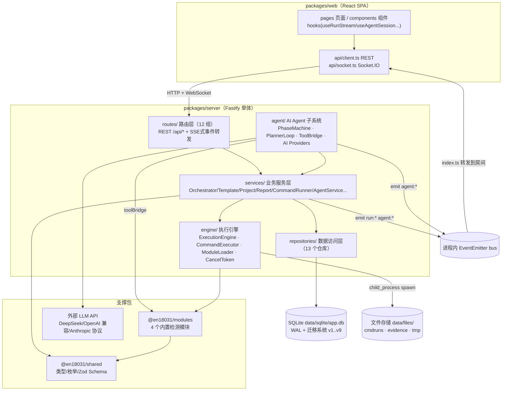
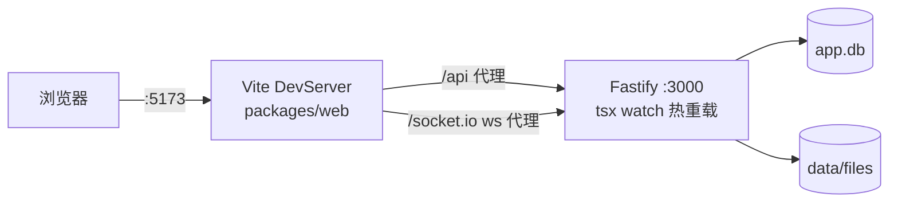
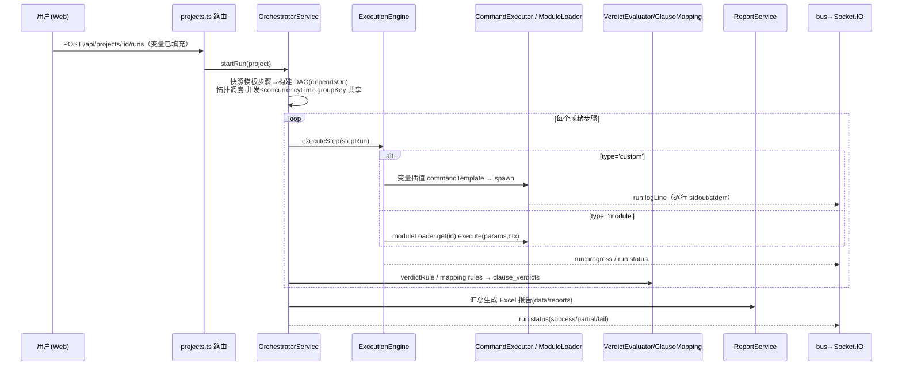
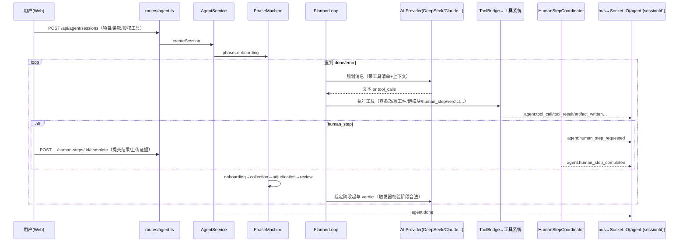

# 02 · 整体架构

## 1. 分层架构

平台是典型的「前后端分离 + 单体后端」架构，后端内部分为五层，依赖方向自上而下：



要点：

- **routes 层不写业务逻辑**：只做 zod 校验、信封包装、权限守卫，然后调用 service；
- **services 层持有统一容器** `Services`（`services/index.ts` 的 `getServices()` 单例），包含 repos、engine、moduleLoader、bus 与各业务服务；服务间通过构造时注入的 `ServiceContext`（repos/engine/moduleLoader/bus/userId）协作；
- **engine 层是唯一的进程外执行出口**：命令行工具经 `commandExecutor` spawn，TS 模块经 `moduleLoader` 动态 import 后调用；
- **bus 是解耦的进程内事件总线**：路由层/服务层只管 `bus.emit('run:logLine'|'agent:phase'|...)`，入口 `index.ts` 统一订阅并按房间转发给 Socket.IO。

## 2. 运行时拓扑

### 开发模式（两个进程）



- 前端 `pnpm dev:web`：Vite 监听 **5173**，把 `/api` 与 `/socket.io`(ws) 反代到 `127.0.0.1:3000`（见 `web/vite.config.ts`）；
- 后端 `pnpm dev:server`：`tsx watch src/index.ts` 监听 **3000**（默认 `HOST=0.0.0.0`），启动即自动迁移建库 + 种子数据。

### 生产模式（单进程）

先 `pnpm build`（各包 tsc 编译 + web vite build 到 `packages/web/dist`），再 `pnpm start`。server 检测到 `WEB_DIST_DIR`（默认 `packages/web/dist`）存在时用 `@fastify/static` 托管静态资源，并对非 `/api`、非 `/socket.io` 的路径回退 `index.html`（SPA history 路由）。此时浏览器直接访问 `http://host:3000`，无需 Vite。

### 安全边界（index.ts）

| 机制 | 实现 |
| --- | --- |
| Host 白名单 | `onRequest` 钩子校验 `Host` 头，不在 `ALLOWED_HOSTS` 且非内网地址时返回 `403 {code:9003}`；绑定 `0.0.0.0` 时放行 loopback/LAN 私网 IP 与无点主机名 |
| CORS | `corsOrigin` 回调仅允许 localhost/127.x 及（绑 0.0.0.0 时）私网 origin，携带 credentials |
| 上传限制 | `@fastify/multipart` 单文件上限 `UPLOAD_MAX_BYTES`（默认 200MB）；请求体上限 25MB |
| 鉴权 | 默认关闭（`AUTH_ENABLED=false`），服务以固定用户 `local-admin`（admin 角色）运行；`authzService` 提供角色判定骨架 |
| 审计 | `audit_logs` 表由数据库触发器保证 append-only（禁止 UPDATE/DELETE） |

## 3. 三条核心数据流

### 3.1 模板模式执行流（template mode）



关键机制：

- 步骤失败策略 `onFailure: abort | continue | retry`（retry 带 `retryBackoffMs` 退避）；
- 同一条款下相同 `groupKey` 的步骤共享一次执行结果（一次扫描喂多条检查）；
- `exportVars` 支持从步骤输出提取变量（jsonpath/regex/field/file 四类规则）供后续步骤引用；
- 判定落库受数据库触发器约束：模板模式的 step_run（无 agentSessionId）可直接写 verdict，Agent 会话的 step_run 仅允许在 `adjudication` 阶段写入。

### 3.2 工具库命令直跑流（CommandRun）

用户在「工具库/终端」页选择工具命令 → `DynamicForm` 渲染参数表单 → `POST /api/tools/:toolId/run`（或命令运行端点）创建 CommandRun → `CommandRunnerService` 经 `commandExecutor` spawn → stdout/stderr 逐行写入 `data/files/cmdruns/{runId}.stdout.log|.stderr.log` 并通过 `run:{runId}` 房间实时推送 → 前端 `Terminal` 组件渲染。该流程独立于项目流水线，用于快速验证工具与收集证据。

### 3.3 Agent 引导评估流（agent_guided mode）



细节见 [08-Agent 智能体子系统](./08-agent-subsystem.md)。

## 4. 事件总线与实时推送（唯一推送通道）

`services/index.ts` 创建 `EventEmitter`（maxListeners=100）作为全局 `bus`；`index.ts` 在启动时完成「bus → Socket.IO 房间」的映射：

| 总线事件组 | 房间 | 事件名 |
| --- | --- | --- |
| 项目/步骤执行 | `run:{projectRunId}`（也复用于 CommandRun 流） | `run:logLine`、`run:progress`、`run:status`、`run:batchProgress` |
| 工具健康 | 广播（io.emit 全局） | `tool:health` |
| Agent 会话 | `agent:{sessionId}` | `agent:session`、`agent:phase`、`agent:step_started`、`agent:tool_call`、`agent:tool_output`、`agent:tool_result`、`agent:human_step_requested`、`agent:human_step_completed`、`agent:evidence_attached`、`agent:artifact_written`、`agent:verdict_drafted`、`agent:verdict_updated`、`agent:message`、`agent:waiting_confirm`、`agent:progress`、`agent:error`、`agent:done` |

客户端入房方式（`index.ts` 的 `io.on('connection')`）：握手 query `?runId=` / `?sessionId=` 自动加入；或连接后发 `subscribe` / `unsubscribe` 消息。前端封装在 `web/src/api/socket.ts` 与 `hooks/useRunStream.ts`、`useAgentSession.ts`、`useCommandRunStream.ts`。

## 5. 服务容器装配顺序（services/index.ts）

```
getRepositories() → bus(EventEmitter) → ModuleLoader → ExecutionEngine(moduleLoader)
  → ServiceContext{repos, engine, moduleLoader, bus, userId:'local-admin'}
  → AuthzService → ToolRegistryService → TemplateService → ProjectService
  → ClauseMappingService → ReportService(setReportService 全局引用)
  → OrchestratorService → CommandRunnerService → AgentService(repos, engine, moduleLoader, bus)
initServices(): getServices() + await moduleLoader.loadBuiltins()
```

启动链路（`index.ts#bootstrap()`）：注册 cors/multipart → Host 守卫钩子 → `/api/health` → 注册 11 组路由 → `initServices()` → `runSeed()`（工作空间/local-admin/标准条款/内置模块注册/命令工具种子）→ 挂 Socket.IO 并绑定 bus 转发 → 挂载前端静态资源 → 监听端口；SIGINT/SIGTERM 时按 io.close → app.close → closeDb 优雅退出。
