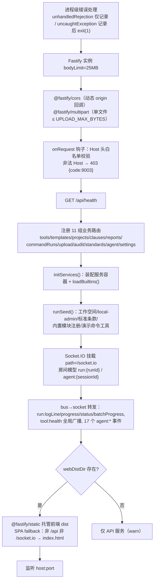

# 05 · server 数据与服务端基础（@en18031/server 上篇）

> 位置：`packages/server` · Fastify 4.28 + better-sqlite3 11 + socket.io 4.7 + pino 9 + zod · 纯 ESM
> 本篇覆盖：入口启动、配置、日志、数据库设计与 Repository 层。业务服务/执行引擎见 [06](./06-server-services-engine.md)，API 见 [07](./07-api-reference.md)，Agent 见 [08](./08-agent-subsystem.md)。

## 1. 启动流程（src/index.ts → `bootstrap()`）

- **Host 白名单** `isAllowedHost()`：命中 `ALLOWED_HOSTS` 放行；绑定 `0.0.0.0` 时额外放行 loopback 与私网段（10./192.168./169.254./172.16-31.）及无点裸主机名 —— 防 DNS rebinding。
- **CORS** `corsOrigin()`：无 origin（同源/curl）放行；localhost/127.* 放行；私网 origin 仅在绑 0.0.0.0 时放行；credentials=true。
- **优雅关闭**：SIGINT/SIGTERM → `io.close()` → `app.close()` → `closeDb()` → exit(0)。

## 2. 配置系统（src/config.ts）

环境变量读取辅助 `env/envInt/envBool`（空串视为未设置）。仓库根目录由 `import.meta.url` 推导，默认数据目录 `<repoRoot>/data`。

### 2.1 AppConfig 配置项总表

| 配置项 | 环境变量 | 默认值 | 用途 |
| --- | --- | --- | --- |
| port | `PORT` | 3000 | HTTP 端口 |
| host | `HOST` | 0.0.0.0 | 监听地址（影响 Host/CORS 白名单） |
| nodeEnv | `NODE_ENV` | development | 控制 pino pretty transport |
| dataDir | `DATA_DIR` | `<repo>/data` | 数据根目录 |
| dbPath | `DB_PATH` | `<dataDir>/sqlite/app.db` | SQLite 文件路径 |
| filesDir | `STORAGE_LOCAL_DIR` | `<dataDir>/files` | 文件存储根 |
| reportsDir | `REPORTS_DIR` | `<dataDir>/reports` | Excel 报告目录 |
| logsDir | `LOG_DIR` | `<dataDir>/logs` | 日志目录 |
| jwtSecret | `JWT_SECRET` | dev-insecure-secret-change-me | 生产必须覆盖 |
| authEnabled | `AUTH_ENABLED` | false | 认证开关（当前恒 local-admin） |
| workspaceDefault | `WORKSPACE_ID_DEFAULT` | default | 默认工作空间 |
| executionConcurrency | `EXECUTION_CONCURRENCY_DEFAULT` | 2 | 执行引擎默认并发 |
| executionTimeoutMs | `EXECUTION_TIMEOUT_DEFAULT_MS` | 1800000（30min） | 单次执行超时 |
| logLevel | `LOG_LEVEL` | info | pino 级别 |
| webDistDir | `WEB_DIST_DIR` | `packages/web/dist` | 前端静态资源 |
| allowedHosts | `ALLOWED_HOSTS` | localhost,127.0.0.1,::1 | Host 白名单（逗号分隔） |
| uploadMaxBytes | `UPLOAD_MAX_BYTES` | 209715200（200MB） | 上传上限 |
| ai.enabled | `AI_ENABLED` | false | AI 总开关 |
| ai.provider | `AI_PROVIDER` | deepseek | deepseek \| scripted |
| ai.baseUrl | `DEEPSEEK_BASE_URL` | https://api.deepseek.com | LLM API 地址 |
| ai.apiKey | `DEEPSEEK_API_KEY` | '' | LLM 密钥 |
| ai.planningModel | `AI_PLANNING_MODEL` | deepseek-chat | 规划模型 |
| ai.narrativeModel | `AI_NARRATIVE_MODEL` | deepseek-chat | 叙述模型 |
| ai.timeoutMs | `AI_TIMEOUT_MS` | 60000 | AI 单次调用超时 |
| ai.maxRetries | `AI_MAX_RETRIES` | 2 | 429/5xx 重试次数 |
| ai.humanStepTimeoutMs | `AGENT_HUMAN_STEP_TIMEOUT_MS` | 1800000 | 人工步骤超时 |
| ai.maxIterations | `AGENT_MAX_ITERATIONS` | 50 | 规划循环迭代硬上限 |

**模块加载副作用**：config.ts import 即创建 7 个目录 —— `dirname(dbPath)`、filesDir、reportsDir、logsDir 及 `files/evidence|tmp|cmdruns`。

### 2.2 日志（src/logger.ts）

pino 单例：development 走 `pino-pretty`（彩色，HH:MM:ss），其他环境输出 JSON 行。全服务（迁移/种子/HTTP 访问日志）共用。

## 3. 数据库设计（src/db/database.ts）

连接 PRAGMA：**WAL** 日志模式、`foreign_keys = ON`（注意：DDL 无显式 REFERENCES，表间关系为逻辑外键）、`busy_timeout = 5000`。测试旁路 `createInMemoryDb()` 提供内存库。

### 3.1 迁移系统

`MIGRATIONS` 有序数组 `{id, name, sql, run?}`；`_migrations` 元表记录版本；每个迁移在单个事务中执行 SQL + 可选编程式 `run(db)`。当前 **schema 版本 9**：

| 版本 | 名称 | 内容 |
| --- | --- | --- |
| v1 | initial_schema | 15 张基础表 + 12 个索引 |
| v2 | audit_log_append_only_triggers | audit_logs 禁 UPDATE/DELETE 触发器 |
| v3 | command_runs_and_tool_commands | command_runs 表 + tools.commands 列 |
| v4 | tool_setup_command | tools.setupCommand 列 |
| v5 | standards_table | 标准登记表 |
| v6 | tool_categories_table | 工具分类表 |
| v7 | compliance_clause_bindings | template_clause_bindings 表 + templates.mode + steps.clauseId/verdictRule/groupKey |
| v8 | agent_human_machine_collab | agent_sessions/agent_events/artifacts 表 + step_runs、clause_verdicts、evidences、projects、clauses 的 Agent 扩展列 + **clause_verdicts_phase_guard 触发器** |
| v9 | settings_table | settings 键值表 |
| v10 | knowledge_skills_notifications | knowledge_notes / skills / notifications 三表 + reports.narrative 列（AI 叙述报告） |
| v11 | template_step_expand_config | template_steps 补 expandSource / expandDims 列（PRAGMA 幂等守卫 + 表存在性守卫，v0.5 起展开配置真正可持久化） |

> **phase_guard 触发器**是架构亮点：当 step_run 属于某 Agent 会话且该会话 phase≠'adjudication' 时，判定 INSERT 被 SQLite 引擎层拒绝 —— 把「只有裁定阶段能出结论」这条业务红线下沉到数据库。

### 3.2 全部表清单（27 张）

| 分组 | 表 | 说明 |
| --- | --- | --- |
| 组织 | workspaces、users | 工作空间/用户（种子固定 default 与 local-admin） |
| 能力目录 | tools、tool_categories、command_runs | 工具实体（软删除+revision 乐观锁+健康状态+referenceCount）/分类/手工命令运行记录 |
| 模板 | templates、template_tools、template_steps、template_clause_bindings | 模板聚合根（软删除+乐观锁）/工具引用（版本锁）/步骤 DAG/合规条款绑定(aggregation JSON) |
| 项目执行 | projects、project_runs、step_runs、evidences、clause_verdicts | 项目（mode: template\|agent_guided）/运行批次/步骤实例(stepSnapshot 快照)/证据/判定(reviewStatus 复核流) |
| 标准 | standards、clauses、clause_mapping_rules | 标准/条款树(PK=(standardVersion,clauseId))/输出映射规则 |
| Agent | agent_sessions、agent_events、artifacts | 会话/append-only 事件流(UNIQUE(sessionId,seq))/工件 |
| 治理 | audit_logs、reports、settings、_migrations | 审计(只追加)/报告(isLatest 唯一)/键值设置(AI Provider 配置)/迁移元数据 |

关键列补充：
- `tools`：tags/formFields/clauses/commands/envVars/healthCheck 均 JSON TEXT；healthStatus green/yellow/red/unknown；
- `step_runs`：stepSnapshot 保存执行时的步骤定义快照；stdoutFileRef/stderrFileRef 指向落盘日志；v8 增加 stepType/phase/functionModule/instruction/expectedOutcome/artifacts/**agentSessionId**（NULL=模板编排步骤）;
- `clause_verdicts`：overridden/overrideReason 人工推翻；v8 增加 reviewStatus(默认 approved)/reviewedBy/reviewedAt/reviewNote/aiGenerated；
- `settings`：目前承载 `ai.providers`（Provider 数组 JSON）与 `ai.activeProviderId` 两键。

完整 ER 关系见子代理报告与源码注释；核心链：templates → projects → project_runs → step_runs → {evidences, clause_verdicts}；agent_sessions → agent_events/artifacts，并经 step_runs.agentSessionId 与执行体系互通。

## 4. 种子数据（db/seed.ts + clauseSeed.ts + commandToolSeed.ts）

`runSeed()` 在每次启动时幂等执行（也可 `pnpm seed` 单独跑）：

1. `categories.seed()`：7 个内置分类（network-compliance/crypto-compliance/credential-compliance/firmware-analysis/authentication/reconnaissance/other）；
2. 创建 workspace `default` 与用户 `local-admin`(admin)；
3. upsert 标准 `EN18031:2019`；
4. 写入 **19 条 EN18031 条款种子**（第 5 章：5.1 身份认证×4、5.2 权限分离×1、5.3 网络通信×6、5.4 加密×4、5.5 固件×4，含 parentId 树、L1/L2/L3 等级、中文 testingMethod 实操指引）；
5. 动态 import `@en18031/modules`，把 4 个内置模块注册为 builtin 工具（create-or-update）；
6. `seedCommandTools()`：2 个演示自定义命令工具共 9 条命令 ——
   - `demo-net-connectivity`「网络连通性工具箱」：ping / nc-port / nslookup / route；
   - `demo-bluetooth-toolkit`「蓝牙检测工具包」(Linux)：hciconfig / hcitool-scan / hcitool-lescan / l2ping / sdptool（部分 requiresRoot，l2ping/sdptool 关联条款 5.3-2），全部带 outputTips 解读提示。

## 5. Repository 层（13 个仓库）

组装容器 `repositories/index.ts`：`getRepositories()` 单例 + `createInMemoryRepositories()` 测试工厂。

### 5.1 统一工程模式

| 模式 | 实现 |
| --- | --- |
| 构造注入 Database | 类均为 `constructor(private db)`，可无缝切换单例库/内存库 |
| 标识与时间 | 主键 `uuid()`，时间 `nowIso()` ISO 字符串 |
| JSON 序列化 | `repositories/json.ts` 的 `parseJson(value, fallback)`（坏数据容错回退，读路径永不崩）/`toJson()`；复杂结构一律 TEXT 列存储 |
| 软删除三件套 | tools/templates/projects：deletedAt + `getById(id, includeDeleted?)` + 列表隐式过滤 |
| **乐观锁 OCC** | 仅 tools.revision 与 templates.revision：`update(id, patch, expectedRevision?)` WHERE 带 `AND revision=?`，changes=0 抛 `Errors.conflict('…已被其他地方修改…')`(409)；不传则跳过（内部写入）。由 `optimisticLock.test.ts` 锁定 |
| 分页契约 | `{items,total}`，page≥1，pageSize 上限 200 |
| 事务封装 | 多表写用 better-sqlite3 同步事务（模板 create/update、报告 save、事件 seq 分配、条款批量导入） |
| append-only 兜底 | audit_logs 与 agent_events 的不可变性由 BEFORE UPDATE/DELETE 触发器 RAISE(ABORT) 保证 |

### 5.2 各仓库职责速览

| 仓库 | 表 | 关键方法与行为 |
| --- | --- | --- |
| ToolRepository | tools | create/getById/list(多条件过滤+tag LIKE)/update(OCC)/setHealth/incrementRefCount/softDelete/countReferences(JOIN 统计真实引用) |
| TemplateRepository | templates 等 4 表 | create/update 单事务写主表+steps+toolRefs+bindings（update 冲突整体回滚）；markUpgradePending(工具升级通知)/clearUpgradePending/setClauseBindings/setMode/countActiveProjects |
| ProjectRepository | projects/project_runs/step_runs | listWithLatestRun(相关子查询防 N+1)；createRun/latestRun/listIncompleteRuns(**崩溃恢复**)；createStepRun/createAgentStepRun/listStepRuns/listStepExecutionsForProject(COUNT+LIMIT 分页跨 run 历史) |
| ResultRepository | evidences/clause_verdicts | insertEvidence/insertVerdict(listApprovedVerdictsByProject——**仅 approved 判定计入评分**)/setReviewStatus/overrideVerdict |
| CommandRunRepository | command_runs | create(status=running)/markFinished/setLink(挂载项目)/listRunning(**崩溃恢复**) |
| ClauseRepository | clauses/mapping_rules | upsert(ON CONFLICT DO UPDATE)/tree(parentId 内存建树,数字感知排序)/countForLevel(**等级语义 ≤ 目标等级**：达 L2 需满足 L1+L2)/mapping rules CRUD/transaction |
| ReportRepository | reports | save(事务内旧报告 isLatest=0 再插新 isLatest=1)/latest/list |
| AgentRepository | agent_sessions/agent_events | createSession/updateStatus/updatePhase/setCurrentStep/incrementRollback/finish;createEvent(**事务内 MAX(seq)+1**,UNIQUE(sessionId,seq))/listEvents(sinceSeq 断线续传) |
| ArtifactRepository | artifacts | create/listBySession/listByProject/delete |
| SettingRepository | settings | PROVIDERS_KEY='ai.providers'/ACTIVE_KEY='ai.activeProviderId';upsertProvider(空 key 不覆盖旧值,isActive 强制单活,baseUrl 尾斜杠归一化)/getActiveProvider/stripKey(API 出参剥离 apiKey)/maskKey(前4+•••+后4 脱敏) |
| StandardRepository / CategoryRepository / AuditRepository | standards/tool_categories/audit_logs | 标准 CRUD;分类 seed/list/create(key 归一化,重复 409)/reorder(相邻交换 sortOrder)/delete(内置禁删,工具回落 other);审计 insert/query(多条件+分页) |

## 6. E2E 冒烟脚本（scripts/*.mjs）

零依赖 Node 脚本（内置 fetch），`SMOKE_BASE` 可覆盖目标（默认 http://127.0.0.1:3000）。统一断言响应信封 `res.ok && json.code === 0`。

### smoke.mjs（`pnpm --filter @en18031/server run test:e2e`）—— 模板编排全链路

1. `/api/health` → 2. 找到内置工具 en18031-port-check → 3. 创建「SMOKE 端口合规模板」（步骤 port-scan，targetIp=127.0.0.1，portRange='22,80,443'）→ 4. 创建项目（EN18031:2019/L2）→ 5. 启动运行并轮询（120 次×1500ms）至终态 → 6. 遍历步骤打印 verdicts（clauseId PASS/FAIL/severity/reason）→ 7. 生成报告打印 grade/summary → 8. 导出 Excel 打印 fileName → `SMOKE OK`。

### smoke-commands.mjs —— 手工命令工作台链路

1. 创建自定义 cmd 工具（ping 命令）→ 2. `POST /api/tools/:id/commands/ping/run` 执行 127.0.0.1 → 3. 轮询 command-runs 至终态，断言 success 且 stdout 含 "packets transmitted" → 4. 建空模板+项目 → 5. `POST /api/command-runs/:runId/attach` 挂载为项目证据 → 6. 校验列表 → `SMOKE COMMANDS OK`。

## 7. TypeScript 工程（tsconfig.json）

继承根 `tsconfig.base.json`（ES2022/strict/Bundler 解析/declaration+sourceMap），覆盖 outDir=dist/rootDir=src/types=["node"]。注意：dev/start/seed 均经 tsx 直接执行 TS 源码，生产亦可不经 dist。
