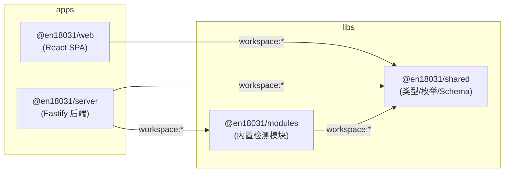
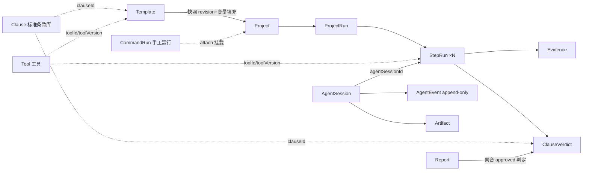

# 10 · 依赖关系

## 1. 包间依赖（pnpm workspace）

- 依赖方向严格单向：`shared` 是零内部依赖的契约根；`modules` 只依赖 shared；server 依赖两者；web 只用 shared（不经 server 的任何代码）。
- shared 与 modules 以 **TS 源码直出**方式被消费（package.json main/types 指向 `src/index.ts`），无构建时序耦合；server 经 tsx 运行 TS，web 由 Vite 直接编译 workspace 依赖。
- 运行期动态边界：server 在 seed 时 `await import('@en18031/modules')`（失败仅告警降级）；settings.ts 与 deepseekProvider 通过**动态 import** 互相引用以打破循环依赖。

## 2. 外部依赖清单

### @en18031/shared
| 依赖 | 用途 |
| --- | --- |
| zod ^3.23.8 | Schema 校验（唯一运行时依赖） |

### @en18031/modules
| 依赖 | 用途 |
| --- | --- |
| @en18031/shared | 契约与校验器 |
| fast-xml-parser ^4.5.0 | 解析 nmap XML 输出（port-check） |
| zod | 结果校验 |
| dev: typescript / vitest / @types/node | 构建、单测 |

### @en18031/server
| 依赖 | 版本 | 用途 |
| --- | --- | --- |
| fastify | ^4.28.1 | HTTP 框架 |
| @fastify/cors | ^9.0.1 | 跨域（动态 origin 白名单） |
| @fastify/multipart | ^8.3.0 | 文件上传（200MB 上限） |
| @fastify/static | ^7.0.4 | 托管 web/dist + SPA fallback |
| better-sqlite3 | ^11.3.0 | SQLite 同步驱动（WAL）；注意 pnpm-workspace 中 `allowBuilds: false` 禁其 postinstall 构建脚本 |
| socket.io | ^4.7.5 | 实时事件推送 |
| pino / pino-pretty | ^9 / ^11 | 结构化日志/开发美化 |
| exceljs | ^4.4.0 | Excel 合规报告生成 |
| fast-xml-parser | ^4.5.0 | XML 解析 |
| zod | ^3.23.8 | 路由层请求校验 |
| @en18031/shared · @en18031/modules | workspace | 契约 / 内置模块 |
| dev: tsx ^4.19 | — | dev/start/seed 直接执行 TS |
| dev: vitest ^2.0.5 / typescript ^5.5.4 | — | 测试/构建 |

### @en18031/web
| 依赖 | 版本 | 用途 |
| --- | --- | --- |
| react / react-dom | ^18.3.1 | UI 框架 |
| antd + @ant-design/icons | ^5.20 / ^5.4 | 组件库（表格/表单/抽屉/模态） |
| react-router-dom | ^6.26 | SPA 路由 |
| socket.io-client | ^4.7.5 | 实时订阅 |
| @en18031/shared | workspace | 类型与枚举复用 |
| dev: vite ^5.4 / @vitejs/plugin-react / typescript | — | 构建链 |

## 3. 操作系统级外部命令依赖

平台执行能力部分来自宿主机 CLI（模块经 engine.runCommand 调用），缺失时模块会给出保守判定并提示补测：

| 命令 | 使用方 | 必需性 |
| --- | --- | --- |
| nmap | port-check、crypto-check(ssl-enum-ciphers NSE)、default-cred-check | 各自必需（健康检查 `nmap --version`） |
| openssl | crypto-check（s_client/x509） | 必需 |
| strings(binutils)、grep、head | firmware-secret-scan | 必需 |
| binwalk | firmware-secret-scan 组件枚举 | 可选（缺失仅记注记） |
| ping/nc/nslookup/netstat | demo-net-connectivity 种子工具 | 演示用 |
| hciconfig/hcitool/l2ping/sdptool | demo-bluetooth-toolkit | Linux+bluez，部分 requiresRoot |

## 4. 关键数据流转关系（实体视角）

要点：
- **模板 → 项目是版本快照关系**（templateVersionSnapshot 记录当时 revision），模板后续修改不影响既有项目；
- **CommandRun 可独立存在**，经 attach 变成项目证据；
- **Agent 会话通过 step_runs.agentSessionId 复用同一套证据/判定存储**，但受 phase_guard 触发器约束；
- **Report 只统计 reviewStatus=approved 的判定**（AI 生成的判定必须人工批准后才计入合规等级）。
